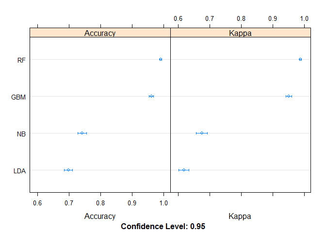
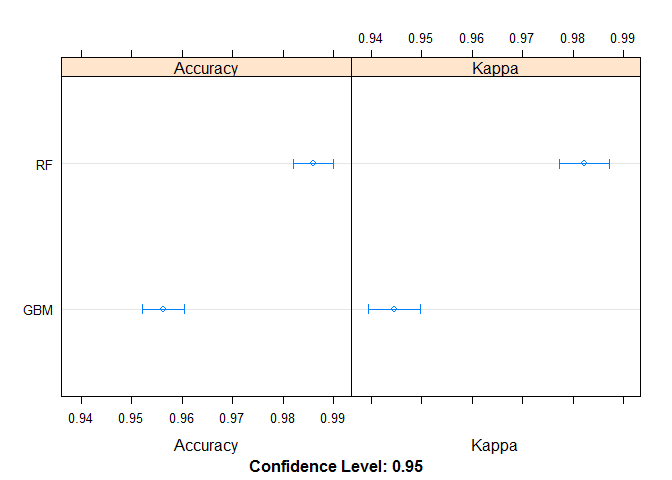

#  A model to predict the quality of weight lifting exercises
aptyos  
21 janvier 2017  

#Synopsis
Investigators in Human ACtivity Recognition have devised strategies on the quality of lifting exercises performed by 
people using a barbell ( ref: http://groupware.les.inf.puc-rio.br/work.jsf?p1=11201).
The quality of exercises was defined by 5 "classe": A,B,C,D and E where A is the best quality.
Here the data they collected is used to determine a (Machine Learning) model to ultimately perform prediction analysis.


## I. Data Processing

1. Loading required R packages.

```r
library(knitr)
library(caret)
library(e1071)
library(parallel)
library(doParallel)
library(klaR)
library(randomForest)
library(dplyr)
library(gbm)
library(survival)
library(splines)
library(plyr)
```

2. Data loading in R. 
As indicated, the source file was downloaded discarding NA and null values.

```r
# v_url <- "https://d396qusza40orc.cloudfront.net/predmachlearn/pml-training.csv"
# temp <- tempfile()
# download.file(v_url,temp)
weightLift<- read.csv("pml-training.csv", stringsAsFactors = TRUE,na.strings = c("NA","") )
# unlink(temp)
```

Column variables of reduced interest were also removed

```r
weightLift <- weightLift[ -c(1,2,3,4,5,6,7)]

# get col with no NA
f_noNa_cols <- function (in_dtf) {
  res_vec <- apply(is.na(in_dtf),2,sum) == 0
  return (res_vec)
}
# dtf minus NA cols
wLift <- weightLift[,f_noNa_cols(weightLift)]
# clean
rm(weightLift)
#------------------------
# functions used
getClasseError <- function(in_mdl) {
  
  mdl_tab <- confusionMatrix(in_mdl)[[1]]
  x_row <- NULL
  for ( i in 1:5) {
    a_pred <- mdl_tab[i,i]
    a_sum  <- sum(mdl_tab[i,])
    x_row <- rbind(x_row, c( (a_sum - a_pred)*100/a_sum)  )
  }
  return(x_row)
}

setRowColNames <- function( v_mtx, v_fitname_list) {
  rownames(v_mtx) <- c("A","B","C","D","E")
  colnames(v_mtx) <- v_fitname_list
  return(v_mtx)
}
```

## II. Data Modeling

The dataset was split into 3 subsets: validation, training and testing:

```r
set.seed(9501432)
cluster <- makeCluster(detectCores() - 1) # convention to leave 1 core for OS
registerDoParallel(cluster)
fitControl <- trainControl(method = "cv", classProbs=TRUE, number = 5, allowParallel = TRUE)

inBuild <- createDataPartition(y=wLift$classe,p=0.85, list=FALSE)
buildData  <- wLift[inBuild,]
validation <- wLift[-inBuild,]

inTrain <- createDataPartition(y=buildData$classe,p=0.8, list=FALSE)
training <- buildData[inTrain,]
testing  <- buildData[-inTrain,]
```


Below is the distribution of the "classe"" variable in the training dataset ( identical results for testing and validation):

```r
percentage <- prop.table(table(training$classe)) * 100
print(cbind(freq=table(training$classe), percentage=percentage))
```

```
##   freq percentage
## A 3795   28.43336
## B 2583   19.35266
## C 2328   17.44212
## D 2188   16.39320
## E 2453   18.37866
```

To determine the best model 4 different methods were tested; Gradient Boosting(gbm), Random Forest(rf), Linear Discriminant Analysis(lda) and Naive Bayes(nb):

```r
fit_gbm <- train(classe ~ ., method = 'gbm', data = training, trControl = fitControl, verbose=FALSE )

set.seed(9501432)
fit_rf <- train(classe ~ ., method = 'rf', data = training, trControl = fitControl)

set.seed(9501432)
fit_lda <- train(classe ~., method="lda",data=training, trControl = fitControl)

set.seed(9501432)
fit_nb <- train(classe ~., method="nb",data=training, trControl = fitControl)
#
stopCluster(cluster)
registerDoSEQ()
```

Results for the 4 models show that RandomForest and Gradient Boosting display best Accuracy and Coherence(kappa):

```r
results <- resamples(list(LDA=fit_lda, NB= fit_nb, RF=fit_rf, GBM=fit_gbm))
print( summary(results) )
```

```
## 
## Call:
## summary.resamples(object = results)
## 
## Models: LDA, NB, RF, GBM 
## Number of resamples: 5 
## 
## Accuracy 
##       Min. 1st Qu. Median   Mean 3rd Qu.   Max. NA's
## LDA 0.6837  0.6939 0.7004 0.6985  0.7027 0.7119    0
## NB  0.7257  0.7393 0.7425 0.7417  0.7426 0.7585    0
## RF  0.9880  0.9899 0.9918 0.9910  0.9921 0.9933    0
## GBM 0.9532  0.9580 0.9603 0.9610  0.9663 0.9674    0
## 
## Kappa 
##       Min. 1st Qu. Median   Mean 3rd Qu.   Max. NA's
## LDA 0.6004  0.6124 0.6203 0.6184  0.6239 0.6350    0
## NB  0.6553  0.6723 0.6764 0.6753  0.6766 0.6961    0
## RF  0.9848  0.9872 0.9896 0.9886  0.9900 0.9915    0
## GBM 0.9408  0.9469 0.9498 0.9507  0.9573 0.9588    0
```

```r
print( dotplot(results))
```

<!-- -->


##### % Errors by model and "classe" classifier
The table below shows that the RandomForest and GBM models bring less error rate in each "classe"

```r
t_error <- getClasseError(fit_rf)
t_error <- cbind(t_error, getClasseError(fit_gbm))
t_error <- cbind(t_error, getClasseError(fit_nb))
t_error <- cbind(t_error, getClasseError(fit_lda))
t_error <- setRowColNames(t_error, c("RF","GBM","NaiveBayes","LDA"))
t_error
```

```
##          RF      GBM NaiveBayes      LDA
## A 0.8634223 2.534622  16.197396 21.99045
## B 0.7039499 6.082914  22.976501 33.71289
## C 2.0806794 6.837248  40.886392 42.03010
## D 0.7823286 3.279446  36.730449 36.64032
## E 0.1229508 1.338912   8.933583 17.00224
```


When applied to the testing and validation sets, the accuracy of the RF and GBM models keeps increasing in both sets,
while it slightly decreases for LDA and NaiveBayes for the validation set.So, LDA and NaiveBayes models where discarded from the analysis.

```r
pred_lda <- predict(fit_lda,testing)
pred_nb <- predict(fit_nb,testing)
pred_rf <- predict(fit_rf,testing)
pred_gbm <- predict(fit_gbm,testing)

rf_accy <- sum( pred_rf == testing$classe)/length(pred_rf)
lda_accy <- sum( pred_lda == testing$classe)/length(pred_lda)
nb_accy <- sum( pred_nb == testing$classe)/length(pred_nb)
gbm_accy <- sum( pred_gbm == testing$classe)/length(pred_gbm)

pred_lda_val <- predict(fit_lda,validation)
pred_nb_val <- predict(fit_nb,validation)
pred_rf_val <- predict(fit_rf,validation)
pred_gbm_val <- predict(fit_gbm,validation)

rf_val_accy <- sum( pred_rf_val == validation$classe)/length(pred_rf_val)
lda_val_accy <- sum( pred_lda_val == validation$classe)/length(pred_lda_val)
nb_val_accy <- sum( pred_nb_val == validation$classe)/length(pred_nb_val)
gbm_val_accy <- sum( pred_gbm_val == validation$classe)/length(pred_gbm_val)
```

#### Accuracy Summary

```r
print(rbind("Naive Bayes"=c(Training= fit_nb$results[2,4],Testing=nb_accy, Validation=nb_val_accy ),
            "LDA"=c(Training= fit_lda$results[1,2],Testing=lda_accy, Validation=lda_val_accy ),
            "RandomForest"= c(Training= fit_rf$results[2,2],Testing=rf_accy, Validation=rf_val_accy ),
            "GBM"= c(Training= fit_gbm$results[nrow(fit_gbm$results),5],Testing=gbm_accy, Validation=gbm_val_accy )
            ))
```

```
##               Training   Testing Validation
## Naive Bayes  0.7417374 0.7473747  0.7430320
## LDA          0.6985071 0.7074707  0.7012237
## RandomForest 0.9910099 0.9924992  0.9942216
## GBM          0.9610400 0.9663966  0.9673691
```


When performing a 2nd split using the previous training set similar results where obtained:

```r
inBuild2 <- createDataPartition(y=training$classe,p=0.85, list=FALSE)
buildData2  <- training[inBuild2,]
validation2 <- training[-inBuild2,]

inTrain2 <- createDataPartition(y=buildData2$classe,p=0.8, list=FALSE)
training2 <- buildData2[inTrain2,]
testing2  <- buildData2[-inTrain2,]
#----
cluster <- makeCluster(detectCores() - 1) 
registerDoParallel(cluster)
#----
set.seed(9501432)
fit_gbm2 <- train(classe ~ ., method = 'gbm', data = training2, trControl = fitControl, verbose=FALSE)

set.seed(9501432)
fit_rf2 <- train(classe ~., method="rf",data=training2, trControl = fitControl)
#---
stopCluster(cluster)
registerDoSEQ()
#---
results <- resamples(list(RF=fit_rf2, GBM=fit_gbm2))
print( summary(results) )
```

```
## 
## Call:
## summary.resamples(object = results)
## 
## Models: RF, GBM 
## Number of resamples: 5 
## 
## Accuracy 
##       Min. 1st Qu. Median   Mean 3rd Qu.   Max. NA's
## RF  0.9824  0.9846 0.9846 0.9859  0.9873 0.9906    0
## GBM 0.9515  0.9548 0.9570 0.9563  0.9576 0.9604    0
## 
## Kappa 
##       Min. 1st Qu. Median   Mean 3rd Qu.   Max. NA's
## RF  0.9777  0.9805 0.9805 0.9822  0.9840 0.9882    0
## GBM 0.9387  0.9429 0.9457 0.9447  0.9463 0.9498    0
```

```r
print( dotplot(results))
```

<!-- -->

```r
pred_rf <- predict(fit_rf2,testing2)
pred_gbm <- predict(fit_gbm2,testing2)

rf_accy <- sum( pred_rf == testing2$classe)/length(pred_rf)
gbm_accy <- sum( pred_gbm == testing2$classe)/length(pred_gbm)

pred_rf_val  <- predict(fit_rf2,validation2)
pred_gbm_val <- predict(fit_gbm2,validation2)

rf_val_accy <- sum( pred_rf_val == validation2$classe)/length(pred_rf_val)
gbm_val_accy <- sum( pred_gbm_val == validation2$classe)/length(pred_gbm_val)

print(rbind( "RandomForest"= c(Training= fit_rf2$results[2,2],Testing=rf_accy, Validation=rf_val_accy ),
            "GBM"= c(Training= fit_gbm2$results[nrow(fit_gbm2$results),5],Testing=gbm_accy, Validation=gbm_val_accy )
))
```

```
##               Training   Testing Validation
## RandomForest 0.9859014 0.9867725     0.9890
## GBM          0.9562729 0.9484127     0.9575
```

##### % Errors by model and "classe" classifier
The table below confirms that the RandomForest model raises less error rate in each "classe"

```r
t_error <- getClasseError(fit_rf2)
t_error <- cbind(t_error, getClasseError(fit_gbm2))
t_error <- setRowColNames(t_error, c("RF","GBM"))
t_error
```

```
##          RF      GBM
## A 0.9241432 2.916347
## B 1.2709417 6.689537
## C 3.3477991 7.720588
## D 1.4895058 3.201635
## E 0.3612282 1.908867
```

## III. Conclusion
Given accuracy,  consistencies and error rates, the Random Forest is retained.

